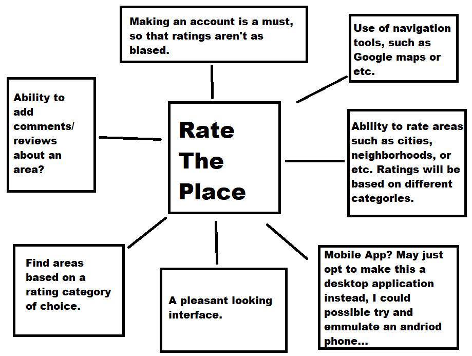

## Senior Project Proposal

1. ### Project Name: *RateThePlace*

2. ### Contact Information:
**Name:** Roberto Reynoso

**Email:** reynoso.roberto.v@gmail.com

**Phone #:** 951-428-8131

3. ### Abstract:
The idea here for this project is to develop an app that incorporates the use of a navigation tool such as Google Maps or etc. That allows the user to rate specific areas such as cities, neighborhoods, and etc. The ratings will include different categories, so the community would be able to rate them high or low depending on what the category is.

4. ### Background/Prior Knowledge:
I'd prefer to work in python since, I feel as though I am passed beginner level in that category, so I'll see if I can implement the back-end with python.

Prior work by others? not from my knowledge no.

Prior work by you? Nope, I will be working from scratch to get this done.

I would say data science/ machine learning, has given me the idea for this project and it is something that I am interested in learning and doing, so I can work on other new projects in the future.

Initial Research [research](https://google-developer-training.github.io/android-developer-advanced-course-practicals/unit-4-add-geo-features-to-your-apps/lesson-9-mapping/9-1-p-add-a-google-map-to-your-app/9-1-p-add-a-google-map-to-your-app.html) here is a document I found relating to intergrating navigation tools such as Google Maps in an app.
I am debating whether or not I'd do something with a mobile device or not, I have been feeling to opt to make a desktop app instead.

5. ### Description:
* Why? I feel as though this is a product people would find useful and use. For example if someone is looking to move into a new area/neighborhood/city they could simply check the place's ratings and find what fits their needs.

* What? While ratings like this do exist on the internet, such as rating well-being of a city or neighborhood. I want to develop something that is more community based, so that you can actually see what people think about certain areas and what they would rate them based on different categories. Possible even see comments/reviews/experiences in said places. I want this information to be easily accessible, analyzed, and talked about.

* Who? My target audience are those that are interested in knowing what they are getting into before entering a said area. There are many cases that one doesn't even think about looking into an area to see if it safe to be there, if it is to expensive to be there, or even the quality of life is good there. For those that want that information on the fly, this is their go to app.

* Where? I've been thinking about going the android route, since I can emulate one. If anything I could make this a desktop application.

* How? It will being using a navigation tool, like Google Maps and I'd like to have it where you simply click on a city/area/neighborhood and then have the ability to rate the categories and or leave comments about it.

* When? I believe it would be good enough to demo as long as you can make an account login and find an area within the map and give it those ratings and have those ratings continue to accumlate/be saved, so the rating can continue to change, within each category.

6. ### Significance:
I would feel confident in putting this on my resume, This application deals with/uses different technologies that are used in the real world and I am sure it would impress prospective employers.
I feel as though this idea has greate significance for the purpose of quality-of-life and can/would benefit everyone.

7. ### New Computer Science Concepts:
I'll be learning how to integrate Navigation tools such as Google Maps into an application. I'll be learning how to create a server to save information such as accounts/ratings/ect. Learning how to develop a DesktopApp and or Andriod app.

8. ### Interestingness:
I have lately been really interested in data-management and how we can use data to benefit people's lives. I have been thinking about possible applications that I could create that uses data to benefit someone's quality of life, so a project like this has a lot of meaning to me, since these are the type of skills, I want to develop.

9. ### Tasks and Schedule
I plan to atleast work close to 15 hours a week to make sure, I finish this project, since I am quite passionate about it. From what I see here in a typical project lifecycle, I'd like to follow that corriculum. Where it is 10% Research & Development, 20% Requirements Analysis, 30% Implementation, and 40% Test and Integration. If I were to work about 15 hours a week, that's about 165 hours in total, so that may be a little over 126 hours. 165 hours is an estimate.

What evidence will you provide that the task is complete for that week? How do you know that it is done?
I could provide a data sheet (maybe excel) to show how much time I have been putting in each area each week, subgoals would be implemented and once a subgoal is completed, i'll know its done for that day/week.

10. ### Resources:
[creating a webserver](https://pythonbasics.org/webserver/)

[implementing navigation tools](https://google-developer-training.github.io/android-developer-advanced-course-practicals/unit-4-add-geo-features-to-your-apps/lesson-9-mapping/9-1-p-add-a-google-map-to-your-app/9-1-p-add-a-google-map-to-your-app.html)

[programming resources](https://www.w3schools.com/)

These are some of the resources I'll be looking into. I know what I have to learn in order to create a project like this, I'll be googling a lot and using the internet to my advantage, to finish this project.

There shouldn't be any cost when making this application, if I anything I could purchase a domain to hold server information, but that is not needed for a project like this.